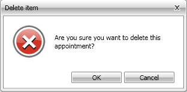

        This topic describes the work flow for deleting an appointment in __RadScheduleView__ control.
      

# Using UI
            In order to delete an appointment in the __RadScheduleView__ you can either select it and press __Del__ key or hover your mouse over it and click the delete key that appears in the upper right corner of the appointment.
          If the appointment you are trying to delete is single one and is not part of any recurrence, a simple confirmation dialog appears asking you to confirm the deletion. Click 'OK' to confirm the deletion or 'Cancel' to stop it.


               
            If the appointment is part of a recurrence series, a more complex confirmation dialog appears asking you what do you want to delete.You can choose between two options:__'Delete this occurrence'__ - delete only this specific occurrence of the whole series.
          __'Delete the series'__ - delete all appointments that belong to this series.
          

Select the option you wish and click 'OK' to confirm the deletion or 'Cancel' to stop it.


# Using code


            You can delete an appointment using the code. Just Call __Remove()__ method of the __RadScheduleView__ control. It returns whether or not  the appointment or the occurrence can be removed. This method has 2 overloads:
          __Remove(IAppointment appointment)__ - the passed appointment is deleting.
              __Remove(Occurrence occurrence)__ - the passed occurrence is deleting.
              


 __C#__
    

```C#


this.radScheduleView.Remove(appointment);

```


 __XAML__
    

```XAML


Me.radScheduleView.Remove(appointment)

```

[Understanding Appointments](http://radscheduleview-getting-started-add-edit-delete-appointment.md)[Create Appointment](http://radscheduleview-end-user-capabilities-create-appointment.md)[Edit Appointment](http://radscheduleview-end-user-capabilities-edit-appointment.md)
