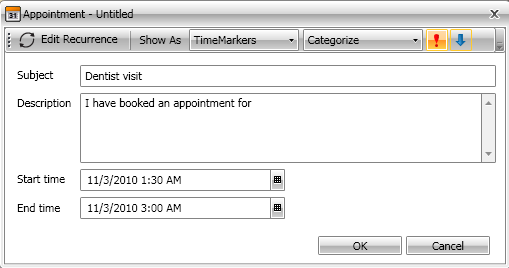

        This topic describes the work flow for editing an appointment in __RadScheduleView__ control.
      

# Using UI

__RadScheduleView__ uses one and the same dialog to create and edit appointments. This topic describes the end-user's work flow for editing an existing appointment.
        


               
            
            In order to edit an appointment just double click it in the __RadScheduleView__.
          If the appointment is not a recurrent one, the edit appointment dialog appears immediately. After the edit appointment dialog is opened, you can change the Subject, Description, Start and End time of the appointment.You can also change or assign category, time marker or importance by using the tool bar controls.You can also change the appointment recurrent.
            If you have completed the appointment edit, click the 'Save & Close' button or press the __Enter__ key.
          
            If you want to cancel the appointment creation, click the X button or press the __Esc__ key.
          

# Using code

You can edit an appointment using the code. Here are the steps to accomplish this:
            Call __BeginEdit()__ method of the __RadScheduleView__ control. It returns whether or not  the appointment or the occurrence can be edited. This method has 3 overloads:
          __BeginEdit()__ - the current appointment is editing.
            __BeginEdit( IAppointment__ appointment ) - the passed appointment is editing.
            __BeginEdit( Occurrence__ occurrence ) - the passed occurrence is editing.
            
            If __BeginEdit()__ returns __True__ - edit the appointment or the occurrence.
          
            Call __Commit()__ method to commit the changes and to update the __UI__.
          

```C#


if (this.radScheduleView.BeginEdit(appointment))
{
    appointment.Subject = "New Subject";
    this.radScheduleView.Commit();
}

```


```VB.NET


If Me.radScheduleView.BeginEdit(appointment) Then
 appointment.Subject = "New Subject"
 Me.radScheduleView.Commit()
End If

```

[Understanding Appointments](http://radscheduleview-getting-started-add-edit-delete-appointment.md)[Create Appointment](http://radscheduleview-end-user-capabilities-create-appointment.md)[Delete Appointment](http://radscheduleview-end-user-capabilities-delete-appointment.md)
