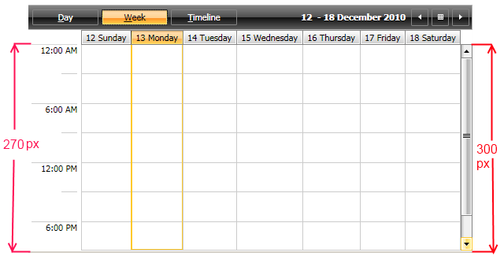
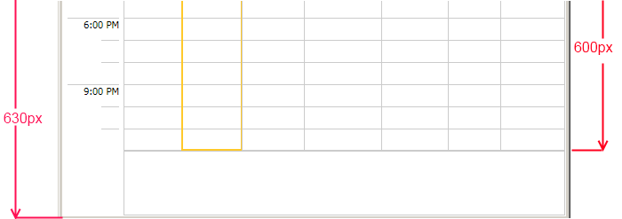

This topic describes how to configurate the TimeRuler of the RadScheduleView control.

# TimeRuler Configuration

There are two key properties that control the Height of the TimeRuler:

* MinTimeRulerExtent 

* MaxTimeRulerExtent 


 __XAML__
    

```XAML


<telerik:RadScheduleView AppointmentsSource="{Binding Appointments}"  
                          MinTimeRulerExtent="300" 
                          MaxTimeRulerExtent="600" >
            <telerik:RadScheduleView.ViewDefinitions>
                <telerik:DayViewDefinition  />
                <telerik:WeekViewDefinition />
                <telerik:TimelineViewDefinition />
            </telerik:RadScheduleView.ViewDefinitions>
</telerik:RadScheduleView>

```


The TimeRuler resizes according the size of the RadScheduleView until the TimeRuler extend is between the Min/MaxTimeRulerExtent properties.

The height of all TimeSlots cannot be greater than the value of MaxTimeRulerExtent property and cannot be smaller than the value of the MinTimeRulerExtent property. Here are several scenarios using Min/MaxTimeRulerExtent properties:

* Setting the MinTimeRulerExtent

In this scenario, if the RadScheduleView control is resized so that the viewport is smaller than the value of the MinTimeRulerExtent property, a ScrollBar appears. The height of the extend is the value of the MinTimeRulerExtent property.


               
            

* Setting the MaxTimeRulerExtent

In this scenario, if the RadScheduleView control is resized so that the extend is greater than the value of the MaxTimeRulerExtent property, the SlotItems stop resizing and the remained space is left empty.


               
            [Overview]({{slug:overview}})
