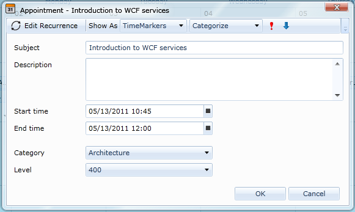
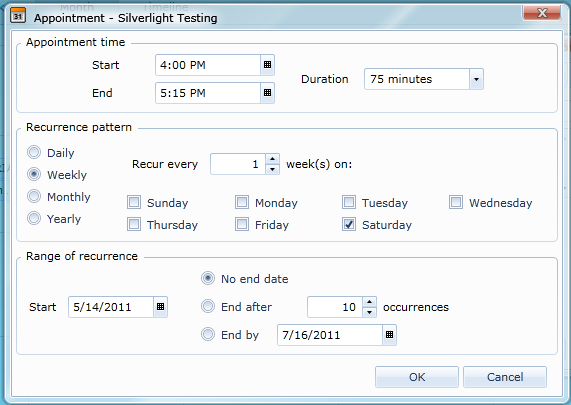
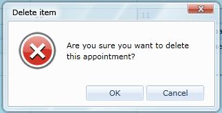
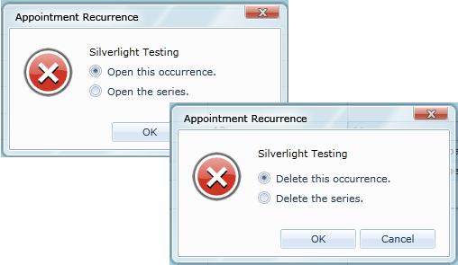
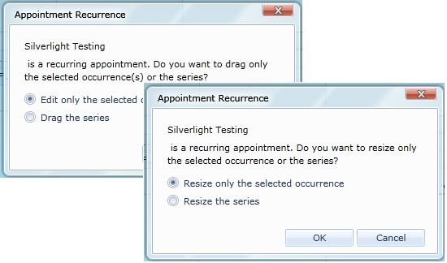

__RadScheduleView__ makes it easy to customize its dialogs. Each RadWindow dialog contains an instance of the SchedulerDialog control as Content. The ViewModel in the DataContext of the SchedulerDialog control is automatically provided and contains all needed properties for the corresponding dialog. __RadScheduleView__ exposes a Style property for each dialog which allows you to apply a Style on the SchedulerDialog control and modify its Template.
      

* General information about RadScheduleView dialogs#general_info

* How to extract the default styles of the dialogs#extract_styles

# general_infoGeneral information about RadScheduleView dialogs

__RadScheduleView__ provides the following dialogs:
        

* EditAppointmentDialog - shown when an appointment is about to be created or edited: 

               
            

In order to create a custom EditAppointmentDialog, use __EditAppointmentDialogStyle__ property of the __RadScheduleView__ control.  The DataContext of this Style target is an AppointmentDialogViewModel object. This class contains all the needed data for editing an appointment including the appointment itself. It can be reached by using the Occurrence property of the ViewModel and its Appointment property:
        

 __XAML__
    

	<TextBox Grid.Row="0" Grid.Column="1" Grid.ColumnSpan="2" Margin="3"
	   IsReadOnly="{Binding IsReadOnly}"
	   Text="{Binding Occurrence.Appointment.Subject, Mode=TwoWay}"
	   telerik:StyleManager.Theme="{StaticResource Theme}" />

Other important properties of the AppointmentDialogViewModel class include:

-  Categories /TimeMarkers – lists of ICategory/ ITimeMarker objects which can be set to the appointment.  In the default EditAppointmentDialog these are used as a DataSource of two RadComboBoxes.

-  ResourceTypes - a list of ResourceTypeViewModel objects.  Each object holds a list of the available resources for the given ResourceType. This collection is used as a DataSource of an ItemsControl with an ItemTemplate where a RadComboBox for each resource type is placed.

-  IsReadOnly – a boolean property bound to the IsEnabled property of all the controls in the dialog. This allows to make the dialog read-only by cancelling the AppointmentEditing event of the ScheduleView – in this case the EditAppointmetDialog will be shown but all the fields will be disabled.>
          Check [Custom Appointment]({{slug:custom-appointment}}) for more details about customizing EditAppointmentDialog.
        

* EditRecurrenceDialog – shown when a recurrence is created or edited: 

               
            

__EditRecurrenceDialogStyle__ property is used to customize this dialog.  The DataContext of the dialog is a RecurrenceDialogViewModel object. It provides information about the RecurrencePattern which is set to the RecurrenceRule of the appointment.
        >
          More information about the recurring patterns can be found [Overview]({{slug:overview}}).
        

* DeleteAppointmentConfirmDialog - shown when the selected appointments are going to be deleted: 

               
            

__DeleteAppointmentConfirmDialogStyle__ property should be set to modify this dialog.  The DataContext of this Style target is of type ConfirmDialogViewModel.  It contains  a reference to the marked for deletion appointments through its Appointments property.
        

* RecurrenceChoiceDialog/RecurrenceChoiceDeleteDialog – shown when a recurrent appointment is about to be edited/deleted: 

               
            

__RecurrenceChoiceDialogStyle__/__RecurrenceChoiceDeleteDialogStyle__ properties are used to edit these dialogs.
        

* RecurrenceChoiceDragDropDialog / RecurrenceChoiceResizeDialog – shown when a recurrent appointment is dragged/resized: 

               
            

__RecurrenceChoiceDragDropDialogStyle / RecurrenceChoiceResizeDialogStyle __properties should be used to customize the corresponding dialogs.

        

The ViewModel of all the RecurrenceChoice dialogs is a __RecurrenceChoiceDialogViewModel__  object.  Its boolean properties IsOccurrenceModeSelected/ IsSeriesModeSelected show which option is selected in the dialog. Also the class contains a reference to the appointment through its Occurrence property.
        >

The ViewModels of all the __ScheduleView__ dialogs inherit from __SchedulerDialogViewModel__ class. It provides the commands for confirming and cancelling the dialog.
          

# extract_stylesHow to extract the default styles of the dialogs

Choose one of the following approaches to obtain the source code of the needed dialogs:

* Generate the style from installation folder

* 
              Generate the style from RadScheduleView template
            
