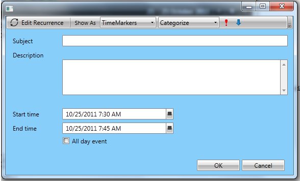
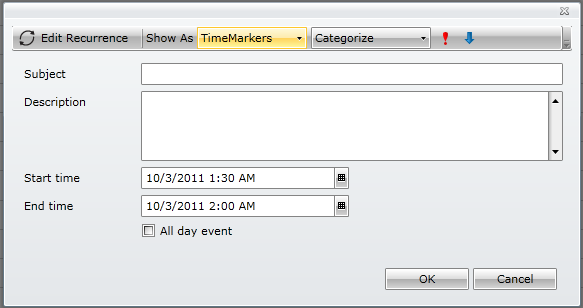

___
title: Customizing Dialog Windows
meta_title: Customizing Dialog Windows
meta_description:description
slug:customizing_dialog_windows
tags:customizing,dialog,windows
publish:True
___

    
    	

To customize the ScheduleView dialogs, e.g. the window content, please read the following article:
  		

	The dialogs in RadScheduleView are displayed by default in RadWindow instances. The RadWindow properties can be customized or it can be entirely replaced with any other ContentControl.
RadScheduleView uses the __IScheduleViewDialogHostFactory__ and __IScheduleViewDialogHost__ interfaces to abstract the dialog hosts and their generation. The default implementation of the IScheduleViewDialogHostFactory interface that creates RadWindow instances is named ScheduleViewDialogHostFactory.

# Customizing RadWindow properties

Create a new class, deriving from ScheduleViewDialogHostFactory and override the CreateNew method:
public class CustomScheduleViewDialogHostFactory : ScheduleViewDialogHostFactory
{
    protected override IScheduleViewDialogHost CreateNew(ScheduleViewBase scheduleView, DialogType dialogType)
    {
        var host = base.CreateNew(scheduleView, dialogType);
        var window = host as RadWindow;
        // Set properties on RadWindow here.
        return host;
    }
}

Configure RadScheduleView to use the new class:
<telerik:RadScheduleView . . .>
	<telerik:RadScheduleView.SchedulerDialogHostFactory>
		<local:CustomScheduleViewDialogHostFactory />
	</telerik:RadScheduleView.SchedulerDialogHostFactory>
</telerik:RadScheduleView>

# Replacing RadWindow with ChildWindowWindow

Create a new class, deriving from WindowChildWindow and implement the __IScheduleViewDialogHost__ interface:
    
public class WindowDialogHost : Window, IScheduleViewDialogHost
{
	public new event EventHandler<WindowClosedEventArgs> Closed;
	public ScheduleViewBase ScheduleView
	{
		get;
		set;
	}
	protected override void OnClosed(System.EventArgs e)
	{
		base.OnClosed(e);
		if (this.Closed != null)
		{
			this.Closed(this, new WindowClosedEventArgs());
		}
	}
	public void Show(bool isModal)
	{
		if (this.Owner == null && this.ScheduleView != null)
		{
			this.Owner = this.ScheduleView.ParentOfType<Window>();
		}
		if (isModal)
		{
			this.ShowDialog();
		}
		else
		{
			this.Show();
		}
	}
}
public class WindowDialogHost : ChildWindow, IScheduleViewDialogHost
{
	private bool opened;
		
	protected override void OnOpened()
	{
		base.OnOpened();
		this.opened = true;
	}
	protected override void OnClosed(System.EventArgs e)
	{
		base.OnClosed(e);
		if (this.Closed != null && this.opened)
		{
			this.opened = false;
			this.Closed(this, new WindowClosedEventArgs());
		}
	}

	public new event EventHandler<WindowClosedEventArgs> Closed;

	public ScheduleViewBase ScheduleView { get; set; }

	void IScheduleViewDialogHost.Close()
	{
		if (this.opened)
		{
			this.Close();
		}
	}

	public void Show(bool isModal)
	{
		this.Show();
	}
}

    Create a new class and implement the __IScheduleViewDialogHostFactory__:
    
public class CustomScheduleViewDialogHostFactory : ScheduleViewDialogHostFactory
{
    protected override IScheduleViewDialogHost CreateNew(ScheduleViewBase scheduleView, DialogType dialogType)
    {
        var window = new WindowDialogHost
        {
            Content = new SchedulerDialog(),
            ScheduleView = scheduleView, 
            Width = 580,
            Height = 350,
            Background = new SolidColorBrush(Colors.LightSkyBlue)
            // Set additional properties here
        };
        return window;
    }
}

public class CustomScheduleViewDialogHostFactory : IScheduleViewDialogHostFactory
{
    public virtual IScheduleViewDialogHost CreateNew(ScheduleViewBase scheduleView, DialogType dialogType)
    {
        var window = new WindowDialogHost
        {
            Content = new SchedulerDialog(),
            ScheduleView = scheduleView
            // Set additional properties here
        };
        return window;
     }    
}

    Configure RadScheduleView to use the new factory:
    
<telerik:RadScheduleView . . .>
	<telerik:RadScheduleView.SchedulerDialogHostFactory>
		<local:CustomScheduleViewDialogHostFactory />
	</telerik:RadScheduleView.SchedulerDialogHostFactory>
</telerik:RadScheduleView>         
      		         
      		
