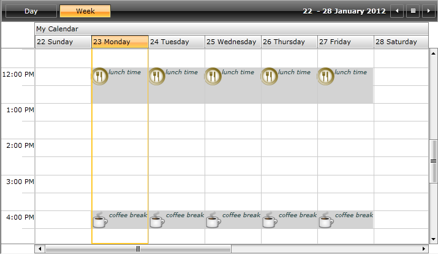

This article describes how you can create a custom SpecialSlot, add custom properties to it and bind the properties in the Slot template.	>

Please check [Special and ReadOnly slots]({{slug:special-and-readonly-slots}}) for more details about SpecialSlots.

# 

Let's for example have the following RadScheduleView grouped by "Calendar" ResourceType:

 __XAML__
    	

<telerik:RadScheduleView AppointmentsSource="{Binding Appointments}">
	<telerik:RadScheduleView.ViewDefinitions>				
		<telerik:WeekViewDefinition  />
	</telerik:RadScheduleView.ViewDefinitions>
	<telerik:RadScheduleView.ResourceTypesSource>
		<telerik:ResourceTypeCollection>
			<telerik:ResourceType Name="Calendar">
				<telerik:Resource ResourceName="My Calendar" />
				<telerik:Resource ResourceName="Team Calendar" />
			</telerik:ResourceType>
		</telerik:ResourceTypeCollection>
	</telerik:RadScheduleView.ResourceTypesSource>
	<telerik:RadScheduleView.GroupDescriptionsSource>
		<telerik:GroupDescriptionCollection>
			<telerik:ResourceGroupDescription ResourceType="Calendar" />
			<telerik:DateGroupDescription />
		</telerik:GroupDescriptionCollection>
	</telerik:RadScheduleView.GroupDescriptionsSource>
</telerik:RadScheduleView>

We will define a custom Slot class, create a collection of custom Slot objects which then will be set to the SpecialSlotsSource property.Also in this tutorial we will crete custom ScheduleViewStyleSelector class and define the needed Styles.

* First, create a class which inherits Telerik.Windows.Controls.ScheduleView.Slot class:

* Then you should create the collection of BreakSlot objects and set their additional properties:

* The next step is to create the ScheduleViewStyleSelector class:

* and to define the Style:

* Finally, bind them to SpecialSlotsSource and SpecialSlotsStyleSelector properties:

Here is the result:
