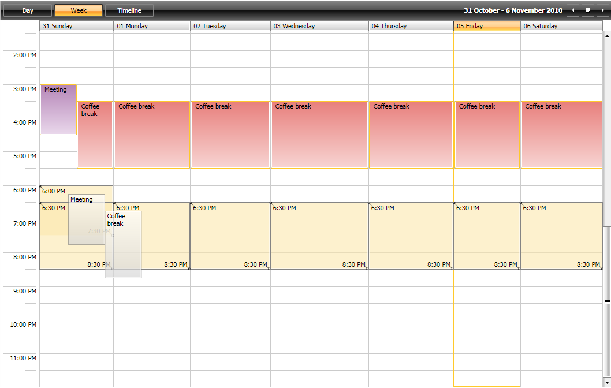

# 


                 
              

__RadScheduleView__ uses __DragDropManager__ to implement drag and drop of appointments. In order to add some custom logic for drag and drop, you can inherit __Telerik.Windows.Controls.ScheduleViewDragDropBehavior__ class. There are several method you can override:
        __CanDrop__(*DragDropState* state) - Gets the value specifying whether the drag and drop operation can be finished, or not.
          __CanStartDrag__(*DragDropState* state) - Gets the value specifying whether the drag operation can be performed, or not.
          __Drop__(*DragDropState* state) - Performs the drag and drop operation.
          __CanResize__(*DragDropState* state) - Gets the value specifying whether the resize operation can be finished, or not.
          __CanStartResize__(*DragDropState* state) - Gets the value specifying whether the resize operation can be performed, or not.
          __Resize__(*DragDropState* state) - Performs the resize operation.
          __DragDropCompleted__( *DragDropState* state) -  This method is called when the drag-drop operation is finished.
          __ConvertDraggedData__(Object data) - This method is fired when you drag appointments from a different source ( other control or application) and is used to convert the data to appointment.
          __CoerceDraggedItems__(*DragDropState* state) - Initializes the drag operation. This method could be used to filter the selected appointments.
          


    
    	


            The __*state*__ parameter of each method identifies the current drag operation.
          

After the CustomDragDropBehavior is implemented, all you need is to set it as RadScheduleView.DragDropBehavior:


    __XAML__
    

```XAML


<telerik:RadScheduleView.DragDropBehavior>
  <local:CustomDragDropBehavior />
</telerik:RadScheduleView.DragDropBehavior>

```


          Check out the 
          
          Drag and Drop Example at 
          [WPF online demos](http://demos.telerik.com/wpf/)[online demo](http://demos.telerik.com/silverlight/#ScheduleView/DragDrop)
          to see the __RadScheduleView__'s Drag and Drop functionality in action.
        
