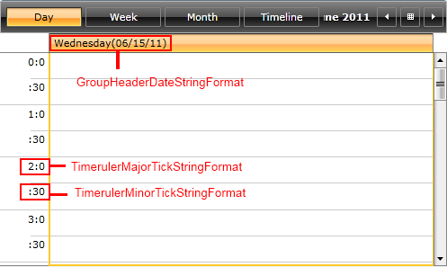
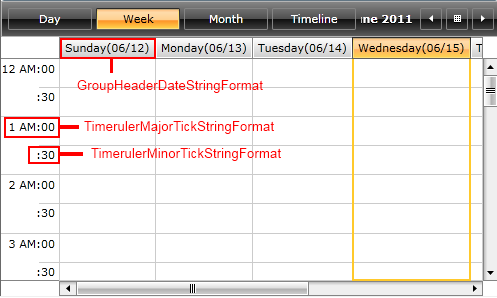
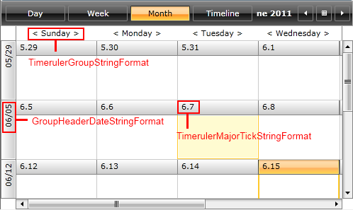
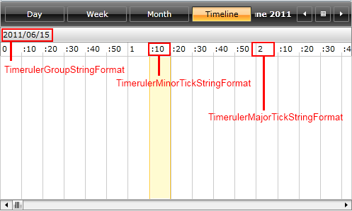

The __RadScheduleView__ control provides a built-in date
        formatting support. Each ScheduleView ViewDefinition can be easily customized
        to display dates and times on the time ruler and in the GroupHeaders in custom
        formats.
      

This article covers the following topics:

* [Formatting properties](#formatting_properties)

* 
          How to apply the formatting properties to the ViewDefinitions:
          

* [DayViewDefinition](#DayViewDefinition)

* [WeekViewDefinition](#WeekViewDefinition)

* [MonthViewDefinition](#MonthViewDefinition)

* [TimelineViewDefinition](#TimelineViewDefinition)

# formatting_propertiesFormatting properties

- TimerulerMajorTickStringFormat /TimerulerMinorTickStringFormat -
          used to set the format that will be applied on TimeRuler
          MajorTick/MinorTick;
        

- TimerulerGroupStringFormat - sets the format applied on
          TimeRulerGroupItem;
        

- GroupHeaderDateStringFormat - sets the format applied on the Date
          GroupHeaders.
        >
            In this article
            custom dates and time format strings will be used for setting the various
            RadScheduleView's properties. For more information about the custom date
            and time format specifiers and the result string produced by each format
            specifier, check out the <externalLink xmlns="http://ddue.schemas.microsoft.com/authoring/2003/5"><linkText>Custom Date and Time Format Strings</linkText><linkUri>http://msdn.microsoft.com/en-us/library/8kb3ddd4.aspx</linkUri></externalLink>
            topic.
          ><para xmlns="http://ddue.schemas.microsoft.com/authoring/2003/5">
              You will notice that some of the format strings start with {} and
              some don't. The two curly brackets are required when declaring a format
              string in XAML that starts with a opening curly bracket, in order to
              prevent the XAML parser from recognizing it as a markup extension. If
              the format string starts with a different character, the {} are not
              needed.
            </para>

# How to apply the formatting properties to the ViewDefinitions

# DayViewDefinitionDayViewDefinition

Let’s for example set the formatting properties of DayViewDefinition:

 __XAML__
    

	<telerik:RadScheduleView  AppointmentsSource="{Binding Appointments}">
	    <telerik:RadScheduleView.ViewDefinitions>
	        <telerik:DayViewDefinition
	            TimerulerMajorTickStringFormat="{}{0:%H}:{0:%m} "
	            TimerulerMinorTickStringFormat=":{0:mm} "
	            GroupHeaderDateStringFormat="{}{0:dddd(MM/dd/yy)}" />
	        ...  
	    </telerik:RadScheduleView.ViewDefinitions>
	 </telerik:RadScheduleView>

               
            

# WeekViewDefinitionWeekViewDefinition

Setting these properties to WeekViewDefinition will lead to similar
          result:
        

 __XAML__
    

	<telerik:RadScheduleView  AppointmentsSource="{Binding Appointments}">
	    <telerik:RadScheduleView.ViewDefinitions>
	        ...
	        <telerik:WeekViewDefinition
	            TimerulerMajorTickStringFormat="{}{0:h tt}:{0:mm} "
	            TimerulerMinorTickStringFormat=":{0:mm}"
	            GroupHeaderDateStringFormat="{}{0:dddd(MM/dd)}"  />              
	        ...  
	    </telerik:RadScheduleView.ViewDefinitions>
	 </telerik:RadScheduleView>

               
            

# MonthViewDefinitionMonthViewDefinition

In MonthViewDefinition you can set the following formatting properties:

 __XAML__
    

	<telerik:RadScheduleView  AppointmentsSource="{Binding Appointments}">
	    <telerik:RadScheduleView.ViewDefinitions>
	        ...                     
	        <telerik:MonthViewDefinition
	            TimerulerGroupStringFormat="&lt; {0:dddd} &gt;"
	            TimerulerMajorTickStringFormat="{}{0:%M}.{0:%d}"             
	            GroupHeaderDateStringFormat="{}{0:MM/dd}"/>
	        ...
	    </telerik:RadScheduleView.ViewDefinitions>
	</telerik:RadScheduleView>

And the result is:

               
            

# TimelineViewDefinitionTimelineViewDefinition

Setting the formatting properties in TimelineViewDefinition like this:

 __XAML__
    

	<telerik:RadScheduleView  AppointmentsSource="{Binding Appointments}">
	    <telerik:RadScheduleView.ViewDefinitions>
	        ...       
	        <telerik:TimelineViewDefinition
	            TimerulerGroupStringFormat="{}{0:yyyy/MM/dd}"
	            TimerulerMajorTickStringFormat="{}{0:%H}"
	            TimerulerMinorTickStringFormat=":{0:%m}"
	            MajorTickLength="1h"
	            MinorTickLength="10min"
	            MinTimeRulerExtent="30400"
	            MaxTimeRulerExtent="30400" />
	         ...
	        </telerik:RadScheduleView.ViewDefinitions>
	</telerik:RadScheduleView>

results in the following look:

               
            

Check out the 
          [online demo](http://demos.telerik.com/silverlight/?ScheduleView/CustomDateFormats)[RadScheduleView Custom Date Formats example](http://demos.telerik.com/wpf/) to see the formatting properties in
          action.
        
