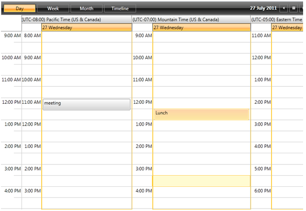
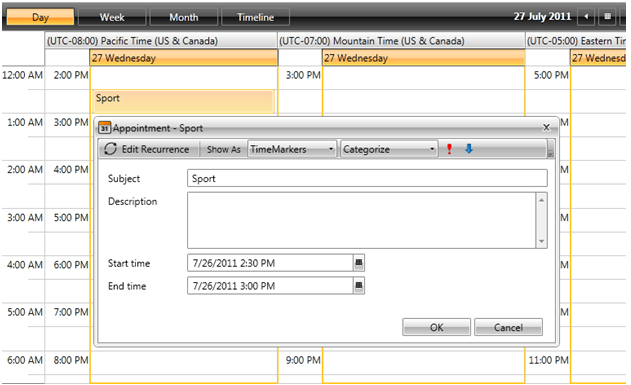

___
title: Grouping By TimeZone
meta_title: Grouping By TimeZone
meta_description:description
slug:grouping_by_timezone
tags:grouping,by,timezone
publish:True
___

        RadScheduleView supports grouping by time zone. This can be achieved by adding a __TimeZoneGroupDescription__ to the GroupDescriptionSource property of RadScheduleView:
      

<telerik:RadScheduleView AppointmentsSource="{Binding Appointments}" TimeZonesSource="{Binding TimeZones}">
   <telerik:RadScheduleView.ViewDefinitions>
      <telerik:DayViewDefinition />
      <telerik:WeekViewDefinition />
      <telerik:MonthViewDefinition  />
      <telerik:TimelineViewDefinition />
   </telerik:RadScheduleView.ViewDefinitions>
   <telerik:RadScheduleView.GroupDescriptionsSource>
      <telerik:GroupDescriptionCollection>
         <telerik:TimeZoneGroupDescription />
      </telerik:GroupDescriptionCollection>
   </telerik:RadScheduleView.GroupDescriptionsSource>
</telerik:RadScheduleView>

This type of grouping groups the appointments by their TimeZone property. One appointment cannot be displayed in two timezones.

             
          

    
    	

Grouping by TimeZone is not supported for MonthViewDefinition. 

# 
        TimeZonesSource property
      

The displayed groups can be configured by the __TimeZonesSource __property of the control. This property can be bound to any collection of __TimeZoneInfo objects__.
If this property is not set, all system time zones will be displayed. the Time Zones that will be displayed are TimeZoneInfo.Local and TimeZoneInfo.Utc.

When the view is grouped by a TimeZone, the EditApointmentDialog will display the Start and End time converted to the corresponding TimeZone: 

         
      
