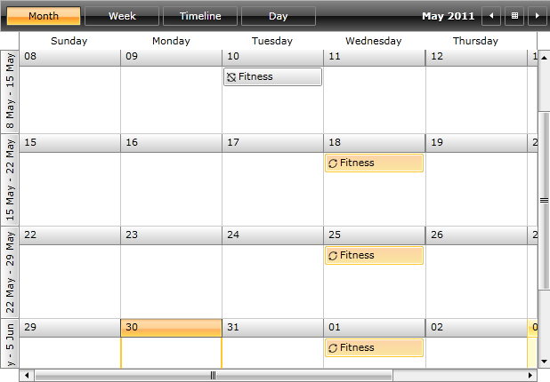

__RadScheduleView__ includes support for recurring events on daily, weekly, monthly and yearly basis. Exceptions to the recurrence rules are also permitted. To support this recurrence behavior, the __IAppointment__ interface includes the __RecurrenceRule__ property. When an appointment is promoted into a recurring event its __RecurrenceRule__ is set with correct [RecurrencePattern](3F113E6D-5519-40FD-A3B3-6A46B2489318).
      

The __RecurrenceRule__ class is the engine for creating and evaluating recurrence rules.
      

The purpose of this tutorial is to show you:

* 
          The main properties exposed by the __RecurrenceRule__ class:
          

* [RecurrencePattern](#RecurrencePattern)

* [Exceptions](#Exceptions)

* [How to create a recurrence rule and associate it with an appointment](#How_to_Create_a_Recurrence_Rule_and_Associate_it_With_an_Appointment)

* [How to add exception occurrences to the recurrence rule](#How_Add_Exception_Occurrences_to_the_Recurrence_Rule)

# RecurrenceRule Class

While the __RecurrencePattern__ class carries the main information about the occurrence, the __RecurrenceRule__ class is the engine for creating and evaluating recurrence rules.
        

The __RecurrenceRule__ class is located in the __Telerik.Windows.Controls.ScheduleView__ namespace of the __Telerik.Windows.Controls.ScheduleView.dll__ assembly.
        

The next several sections describe which are the main properties and methods exposed by the __RecurrenceRule__ class.
        

# RecurrencePatternRecurrencePattern

The __RecurrenceRule__ class exposes a __RecurrencePattern__ property, which allows you to get\set the recurrence pattern associated with the current rule. For more information about the __RecurrencePattern__, take a look at the [RecurrencePattern](3F113E6D-5519-40FD-A3B3-6A46B2489318) topic, which is entirely dedicated to recurrence patterns.
        

# ExceptionsExceptions

The __RecurrenceRule__ class exposes an __Exceptions__ property, which allows you to get or set all exception occurrences associated with the current rule. For more information read [How to Add Exception Occurrences to the Recurrence Rule](#How_Add_Exception_Occurrences_to_the_Recurrence_Rule)

# How_to_Create_a_Recurrence_Rule_and_Associate_it_With_an_AppointmentHow to Create a Recurrence Rule and Associate it With an Appointment

The __RecurrenceRule__ class has only one public constructor, which accepts a __RecurrencePattern__ as a parameter.
        
          The __RecurrencePattern__ is a mandatory part of the __RecurrenceRule__. Which means that when creating a new __RecurrenceRule__ you must associate the rule with a recurrence pattern.
        

 __C#__
    

	var startDate = new DateTime(2011, 05, 11, 10, 0, 0);
	var fitnessAppointment = new Appointment()
	{
	    Start = startDate,
	    End = startDate.AddHours(2),
	    Subject = "Fitness"
	};
	var recurrencePattern = new RecurrencePattern()
	{
	    Frequency = RecurrenceFrequency.Weekly,
	    MaxOccurrences = 30,
	    DaysOfWeekMask = RecurrenceDays.Monday | RecurrenceDays.Wednesday | RecurrenceDays.Friday
	};        
	fitnessAppointment.RecurrenceRule = new RecurrenceRule(recurrencePattern);

 __VB.NET__
    

	Dim startDate = New DateTime(2011, 5, 11, 10, 0, 0)
	Dim fitnessAppointment = New Appointment() With {
	    .Start = startDate,
	    .[End] = startDate.AddHours(2),
	    .Subject = "Fitness"
	}
	Dim recurrencePattern = New RecurrencePattern() With {
	    .Frequency = RecurrenceFrequency.Weekly,
	    .MaxOccurrences = 30,
	    .DaysOfWeekMask = RecurrenceDays.Monday Or RecurrenceDays.Wednesday Or RecurrenceDays.Friday
	}
	fitnessAppointment.RecurrenceRule = New RecurrenceRule(recurrencePattern)

The above example shows you how to create a recurrence pattern, then how to associate it with a recurrence rule. Finally the recurrence rule is assigned to an appointment.

# How_Add_Exception_Occurrences_to_the_Recurrence_RuleHow to Add Exception Occurrences to the Recurrence Rule

__RadScheduleView's__ API permits you to add exception occurrences to the recurrence rule. In order to add exceptions, you should use the __RecurrenceRule__'s __AddException()__ method. The __AddException()__ method has two overloads.
        

The first one takes two parameters:

* 
            The first parameter is a __DateTime__ which indicates when the exception occurs.
          

* 
            The second parameter is an __IAppointment__ instance. This is the exception appointment.
          

When you want to add an exception to a recurrence you need to use this method.

The second overload takes only one argument - a __DateTime__ parameter. The purpose of this overload is to add an exception by __removing__ a given occurrence from a recurrence.
        

One possible scenario of adding an exception to a recurrence rule is shown in the next example:

* Create a new appointment. 

 __C#__
    

	var startDate = new DateTime(2011, 05, 11, 10, 0, 0);
	var fitnessAppointment = new Appointment()
	{
	    Start = startDate,
	    End = startDate.AddHours(2),
	    Subject = "Fitness"
	};

 __VB.NET__
    

	Dim startDate = New DateTime(2011, 5, 11, 10, 0, 0)
	Dim fitnessAppointment = New Appointment() With {
	    .Start = startDate,
	    .[End] = startDate.AddHours(2),
	    .Subject = "Fitness"
	}

* 
            Create a [RecurrencePattern](3F113E6D-5519-40FD-A3B3-6A46B2489318).
          

 __C#__
    

	var recurrencePattern = new RecurrencePattern()
	{
	    Frequency = RecurrenceFrequency.Daily,
	    DaysOfWeekMask = RecurrenceDays.Wednesday,
	    MaxOccurrences = 10
	};

 __VB.NET__
    

	Dim recurrencePattern = New RecurrencePattern() With {
	    .Frequency = RecurrenceFrequency.Daily,
	    .DaysOfWeekMask = RecurrenceDays.Wednesday,
	    .MaxOccurrences = 10
	}

* [Create](#How_to_Create_a_Recurrence_Rule_and_Associate_it_With_an_Appointment) a __RecurrenceRule__ and associate the create recurrence pattern with it.
          

 __C#__
    

	var rule = new RecurrenceRule(recurrencePattern);

 __VB.NET__
    

	Dim rule = New RecurrenceRule(recurrencePattern)

* Add an exception occurrence to the recurrence rule. 

 __C#__
    

	var exceptionDate = fitnessAppointment.Copy()
	exceptionDate.Start = fitnessAppointment.Start.AddDays(-1);
	exceptionDate.End = fitnessAppointment.End.AddDays(-1);          
	rule.AddException(startDate, exceptionDate);

 __VB.NET__
    

	Dim exceptionDate = fitnessAppointment.Copy()
	exceptionDate.Start = fitnessAppointment.Start.AddDays(-1)
	exceptionDate.[End] = fitnessAppointment.[End].AddDays(-1)
	rule.AddException(startDate, exceptionDate)

* Associate the create recurrence rule with the appointment. 

 __C#__
    

	fitnessAppointment.RecurrenceRule = rule;

 __VB.NET__
    

	fitnessAppointment.RecurrenceRule = rule

When adding the created appointment to the __RadScheduleView__'s __AppointmentsSource __collection the result should be similar to the snapshot below.

        

               
            

