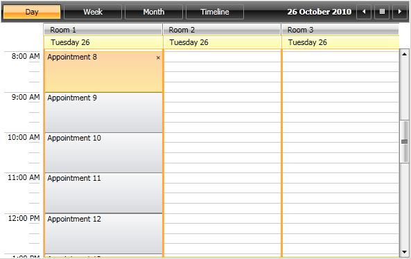
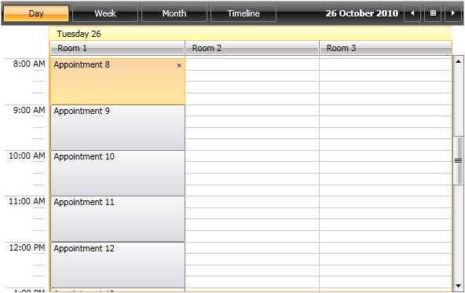

The __RadScheduleView__ allows you to define custom resources that can be assigned to the appointments. Custom resources let you associate additional information with your appointments, where the information for each field can be selected from a limited number of possibilities. For example, you can load the appointments of different users on a single scheduler by simply choosing the name of the user from a drop down. The same applies for various resources such as meeting rooms, team events, etc.
      

Because custom resources have a limited number of values, __RadScheduleView__ can group appointments based on the resources associated with them. For example, you can book different facilities for a variety of events. Also, the appointments can be grouped by multiple groups.
      

The purpose of this tutorial is to show you how to work with resources. The following topics will be covered:

* 

Creating __ResourceTypesCollection__

* 

Assigning __ResourceType__ to a __ResourceTypeCollection__

* 

Assigning a __Resource__ to a __ResourceType__ (group)
          

* 

Grouping appointments by __Resources__

# 
        Creating ResourceTypesCollection
      

First of all, let's set a __ResourceTypesCollection__:
        

 __XAML__
    

	<telerik:RadScheduleView>
	   ...
	   <telerik:RadScheduleView.ResourceTypesSource>
	      ...
	   </telerik:RadScheduleView.ResourceTypesSource>
	</telerik:RadScheduleView>

After this, we need to create a __ResourceTypeCollection__, where we can assign the __ResourceType__:
        

 __XAML__
    

	<telerik:RadScheduleView>
	    ...
	    <telerik:RadScheduleView.ResourceTypesSource>
	        <telerik:ResourceTypeCollection>
	          ...
	        <telerik:ResourceTypeCollection>
	    </telerik:RadScheduleView.ResourceTypesSource>
	</telerik:RadScheduleView>

# 
        Assigning ResourceType to a ResourceTypeCollection
      

After we have created a __ResourceTypeCollection__, we can add our __ResourceType__. Here is an example of creating __ResourceType__ with name "Location":
        

 __XAML__
    

	<telerik:RadScheduleView>
	    ...
	    <telerik:RadScheduleView.ResourceTypesSource>
	        <telerik:ResourceTypeCollection>
	            <telerik:ResourceType Name="Location">
	             ...
	            </telerik:ResourceType>
	        </telerik:ResourceTypeCollection>
	    </telerik:RadScheduleView.ResourceTypesSource>
	</telerik:RadScheduleView>

# 

Assigning a Resource to a ResourceType (group)

Once we've created the __ResourceType__, we should create and assign __Resources__ to this group (__ResourceType__):
        

 __XAML__
    

	<telerik:RadScheduleView>
	    ...
	    <telerik:RadScheduleView.ResourceTypesSource>
	        <telerik:ResourceTypeCollection>
	            <telerik:ResourceType Name="Location">
	                <telerik:Resource ResourceName="Room 1" />
	                <telerik:Resource ResourceName="Room 2" />
	                <telerik:Resource ResourceName="Room 3" />
	            </telerik:ResourceType>
	        </telerik:ResourceTypeCollection>
	    </telerik:RadScheduleView.ResourceTypesSource>
	</telerik:RadScheduleView>

# Grouping appointments by Resources

Now if you want to group the appointments by Location, you can use __GroupDescriptionsSource__ property:
        

 __XAML__
    

	<telerik:RadScheduleView>
	    ...
	    <telerik:RadScheduleView.GroupDescriptionsSource>
	        <telerik:GroupDescriptionCollection>
	            <telerik:ResourceGroupDescription ResourceType="Location" />
	        </telerik:GroupDescriptionCollection>
	    </telerik:RadScheduleView.GroupDescriptionsSource>
	</telerik:RadScheduleView>

The code above will group RadScheduleView by resource type named Location. Day view and Week view are always grouped by date, so the new group description will be inserted before the standard DateGroupDescription:

               
            

If you want to change the group order you could use the following syntax:

 __XAML__
    

	<telerik:RadScheduleView>
	    ...
	    <telerik:RadScheduleView.GroupDescriptionsSource>
	        <telerik:GroupDescriptionCollection>
	            <telerik:DateGroupDescription />
	            <telerik:ResourceGroupDescription ResourceType="Location" />
	        </telerik:GroupDescriptionCollection>
	    </telerik:RadScheduleView.GroupDescriptionsSource>
	</telerik:RadScheduleView>

The result will be the following (note the changed group order):

               
            

[Data Binding Support Overview]({{slug:data-binding-support-overview}})
