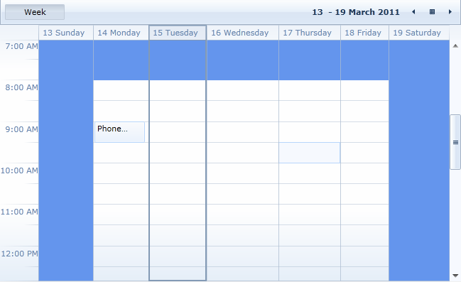
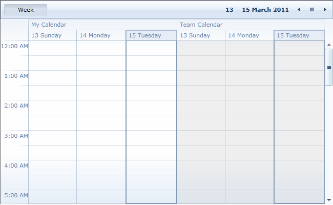

        Using __RadScheduleView for SilverlightWPF__ you can define special and read-only slots and apply different styles to them.  You just need to prepare a collection of Slot objects and assign it to __SpecialSlotsSource__ property of the ScheduleView.
      

Every Slot has the following properties:


            Start - start date of the Slot.
          


            End - end date of the Slot.
          


            Resources - a collection of resources for which the slot is defined.
          


            RecurrencePattern - defines whether the slot will be displayed for repeating days.
          


            IsReadOnly - when set to __true__ the slot is disabled.
          
    
    	


          When a slot is disabled you cannot create, edit, delete or drag and drop appointments in it. The existing appointments in disabled slots are in read-only mode - edit appointment dialog is still shown when the appointment is clicked but its properties cannot be edited.
        


          ReadOnly slots have a greyed-out style applied, but it can be changed with SpecialSlotsStyleSelector.
        

__SpecialSlotsStyleSelector __allows you to apply a separate Style for the special slots. You can use this feature for working/nonworking hours, holidays, days off, etc.
      


        This article will cover the following examples:
      

[Setting a separate Style for nonworking hours](#specialslots)

[Setting all the slots for a given resource to be read-only](#readonlyslots)


          In some cases when using a big number of special slots there could be some __performance__ issues in the RadScheduleView control. In order to not lose performance when using Special and ReadOnly slots you should keep in mind the following measures:
        


              Populate the Slots that are in the visible range only.
            


              If a Slot is in multiple Resources at the same time do not create a separate Slot for each Resource but rather assign the Resources to the Slot.
            


              If a Slot is recurring do not create many different separate Slots but rather create a recurring one.
            


              Treat the Slots as Appointments, the same performance principals exist.
            

# specialslotsSetting a separate Style for nonworking hours


              First you should create the collection of Slot objects and set their RecurrencePattern property:
            


    __C#__
    

```C#


var NonWorkingHours = new ObservableCollection<Slot>();
DateTime start = new DateTime(2010, 1, 1, 8, 0, 0);
DateTime end = new DateTime(2010, 1, 1, 18, 0, 0);
NonWorkingHours.Add(new Slot(end, start.AddDays(1))
{
    RecurrencePattern = new RecurrencePattern(
                null, RecurrenceDays.Monday | RecurrenceDays.Tuesday | RecurrenceDays.Wednesday | RecurrenceDays.Thursday, RecurrenceFrequency.Weekly, 1, null, null)
});

NonWorkingHours.Add(
    new Slot(end, start.AddDays(3))
    {
        RecurrencePattern = new RecurrencePattern(
                    null, RecurrenceDays.Friday, RecurrenceFrequency.Weekly, 1, null, null)
    });

```


              Then create the ScheduleViewStyleSelector class:
            


    __C#__
    

```C#


public class SpecialSlotStyleSelector : ScheduleViewStyleSelector
{
    private Style nonworkingHourStyle;
    public Style NonworkingHourStyle
    {
        get
        {
            return this.nonworkingHourStyle;
        }
        set
        {
            this.nonworkingHourStyle = value;
        }
    }
    public override Style SelectStyle(object item, DependencyObject container, ViewDefinitionBase activeViewDefinition)
    {
        return this.NonworkingHourStyle;
    }
}

```


and define the Style:


    __XAML__
    

```XAML


<local:SpecialSlotStyleSelector x:Key="SpecialSlotStyleSelector">
        <local:SpecialSlotStyleSelector.NonworkingHourStyle>
            <Style TargetType="scheduleView:HighlightItem">
                <Setter Property="Template">
                    <Setter.Value>
                        <ControlTemplate>
                            <Border Background="CornflowerBlue"/>
                        </ControlTemplate>
                    </Setter.Value>
                </Setter>
            </Style>
        </local:SpecialSlotStyleSelector.NonworkingHourStyle>
    </local:SpecialSlotStyleSelector>

```


              Finally, bind them to SpecialSlotsSource and SpecialSlotsStyleSelector properties:
            


    __XAML__
    

```XAML


<telerik:RadScheduleView x:Name="scheduleView"
           SpecialSlotsSource="{Binding NonWorkingHours}"
           SpecialSlotStyleSelector="{StaticResource SpecialSlotStyleSelector}">
...
</telerik:RadScheduleView>

```


Here is the result:

# readonlyslots Setting all the slots for a given resource to be read-only

Let's for example have the following Resource Type defined:


    __XAML__
    

```XAML


<telerik:RadScheduleView x:Name="scheduleView">
 <telerik:RadScheduleView.ResourceTypesSource>
    <telerik:ResourceTypeCollection>
        <telerik:ResourceType Name="Calendar">
            <telerik:Resource ResourceName="John" DisplayName="My Calendar" />
            <telerik:Resource ResourceName="Team" DisplayName="Team Calendar" />
        </telerik:ResourceType>
    </telerik:ResourceTypeCollection>
  </telerik:RadScheduleView.ResourceTypesSource>
  ...
</telerik:RadScheduleView>

```


              You can create the collection of read-only slots for "Team" Resource like this:
            


    __C#__
    

```C#


var ReadOnlySlots = new ObservableCollection<Slot>();
Slot readOnlyslot = new Slot() { 
		Start = DateTime.MinValue, 
		End = DateTime.MaxValue, 
		IsReadOnly = true 
		};
readOnlyslot.Resources.Add(new Resource("Team", "Calendar"));
ReadOnlySlots.Add(readOnlyslot);

```


              And assign it to the ScheduleView's SpecialSlotsSource property:
            


    __XAML__
    

```XAML


<telerik:RadScheduleView  x:Name="scheduleView" SpecialSlotsSource="{Binding ReadOnlySlots}">
...
</telerik:RadScheduleView>

```


 The read-only slots will look like this:


          Note that EditAppointmentDialog is shown even for appointments which are visualized in the read-only slots. In order to prevent it, susbscribe to ShowDialog event of the RadScheduleView:
        


    __XAML__
    

```XAML


<telerik:RadScheduleView x:Name="scheduleView" ShowDialog="scheduleView_ShowDialog">

```


          and cancel it in the event handler:
        


    __C#__
    

```C#


private void scheduleView_ShowDialog(object sender, ShowDialogEventArgs e)
{
    var appointmentDialog = e.DialogViewModel as AppointmentDialogViewModel;
    if (appointmentDialog != null && appointmentDialog.IsReadOnly)
    {
        e.Cancel = true;
    }
}

```


          Check out the 
          [online demo](http://demos.telerik.com/silverlight/#ScheduleView/SpecialSlots)[online demo](http://demos.telerik.com/wpf/?ScheduleView/SpecialSlots) to see special slots in action.
        
