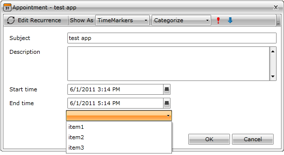

This tutorial explains how to bind additional controls in a custom EditAppointmentDialog to properties in the ViewModel of the __RadScheduleView__.
      

Before we proceed, check these topics:

* [Implementing View-ViewModel ]({{slug:implementing-view-viewmodel-}})

* [Custom Dialogs]({{slug:custom-dialogs}})

* [Custom Appointment]({{slug:custom-appointment}})

Let’s have the following __RadScheduleView__ with EditAppointmentDialogStyle set to the generated Style:
      

 __XAML__
    

	<telerik:RadScheduleView x:Name="ScheduleView"
	    AppointmentsSource="{Binding Appointments}"
	    EditAppointmentDialogStyle="{StaticResource EditAppointmentDialogStyle}">
	   <telerik:RadScheduleView.ViewDefinitions>
	       <telerik:DayViewDefinition />
	 …
	   </telerik:RadScheduleView.ViewDefinitions>
	</telerik:RadScheduleView>

RadComboBox is added to the ControlTemplate of the EditAppointmentDialog:

 __XAML__
    

	<ControlTemplate x:Key="EditAppointmentTemplate" TargetType="local:SchedulerDialog">
	  ... 
	    <telerik:RadComboBox  />
	  ...    
	</ControlTemplate>

The ViewModel of the __ScheduleView__ has an additional property called “ComboBoxItems” which will be used to populate it:
      

 __C#__
    

	public class MyViewModel:ViewModelBase
	{
	    public ObservableCollection<Appointment> Appointments
	    {
	        get;
	        private set;
	    }
	    public ObservableCollection<string> ComboBoxItems
	    {
	        get;
	        private set;
	    }
	    public MyViewModel()
	    {
	        Appointments = new ObservableCollection<Appointment>() {
	            new Appointment() {
	                Subject="test app",
	                Start = DateTime.Now,
	                End = DateTime.Now.AddHours(2)
	            }
	        };
	        ComboBoxItems = new ObservableCollection<string>() {
	            "item1", "item2", "item3"
	        };
	    }
	}

 __VB.NET__
    

	Public Class MyViewModel
	    Public Property Appointments() As ObservableCollection(Of Appointment)
	        Get
	            Return m_Appointments
	        End Get
	        Private Set(value As ObservableCollection(Of Appointment))
	            m_Appointments = value
	        End Set
	    End Property
	    Private m_Appointments As ObservableCollection(Of Appointment)
	    Public Property ComboBoxItems() As ObservableCollection(Of String)
	        Get
	            Return m_ComboBoxItems
	        End Get
	        Private Set(value As ObservableCollection(Of String))
	            m_ComboBoxItems = value
	        End Set
	    End Property
	    Private m_ComboBoxItems As ObservableCollection(Of String)
	
	    Public Sub New()
	        Appointments = New ObservableCollection(Of Appointment)() From {
	         New Appointment() With {
	          .Subject = "test app",
	          .Start = DateTime.Now,
	         .[End] = DateTime.Now.AddHours(2)
	        }
	        }
	        ComboBoxItems = New ObservableCollection(Of String)() From {
	         "item1",
	         "item2",
	         "item3"
	        }
	    End Sub
	End Class

# bindingtodatacontext

If the DataContext is set in XAML:

 __XAML__
    

	<UserControl.Resources>
	    <my:MyViewModel x:Key="MyViewModel" />
	    ...
	</UserControl.Resources>

The ItemsSource can be bound like this:

 __XAML__
    

	<telerik:RadComboBox ItemsSource="{Binding Source={StaticResource MyViewModel}, Path=ComboBoxItems, Mode=TwoWay}" />

Here is the result:

               
            

	>

In order to preselect a certain item in the RadComboBox,  bind __SelectedItem__  to a  property in your [Custom Appointment]({{slug:custom-appointment}}) class:
          

 __XAML__
    

	<telerik:RadComboBox SelectedItem="{Binding Occurrence.Appointment.ComboBoxItem, Mode=TwoWay}"
	            ItemsSource="{Binding Source={StaticResource MyViewModel}, Path=ComboBoxItems, Mode=TwoWay}" />

