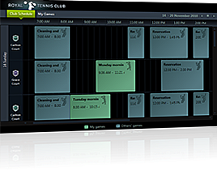

___
title: Overview
meta_title: Overview
meta_description:description
slug:overview
tags:overview
publish:True
___

# 

          Thank you for choosing Telerik __RadScheduleView__!
        

__RadScheduleView __is a radically different scheduling component, going beyond the standard Microsoft Outlook-style control. The __RadScheduleView__ empowers end users with unprecedented control over precision and flexibility when handling their appointments. This is achieved through features such as multi-level grouping, powerful zoom for smart navigation through a large number of appointments and blazing fast scrolling.
        

__RadScheduleView__ key features list:
        __Performance____Edit Forms____Built-in and Custom Views____Multi-level Grouping____Orientation____Exact Rendering of Appointments____Dragging multiple appointments____Zooming____Snap____Appointments____Creating Recurrent Appointment using TimeSlot selection____Truly Lookless, Stylable Control____Rich User Experience____Flexible Recurring Appointments Support__

____

          A complete list with all key features can be found [here](E04CB0D0-76CC-4AE5-AB3A-3C621B40DDED).
        

          Check out the online demo at:[http://demos.telerik.com/wpf/](http://demos.telerik.com/wpf/)[http://demos.telerik.com/silverlight/](http://demos.telerik.com/silverlight/)[Key Features](http://radscheduleview-key-features.md)[Getting Started](http://radscheduleview-getting-started.md)[Understanding Appointments](http://radscheduleview-getting-started-add-edit-delete-appointment.md)
