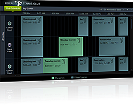

# 

Thank you for choosing Telerik __RadScheduleView__!
        

__RadScheduleView __is a radically different scheduling component, going beyond the standard Microsoft Outlook-style control. The __RadScheduleView__ empowers end users with unprecedented control over precision and flexibility when handling their appointments. This is achieved through features such as multi-level grouping, powerful zoom for smart navigation through a large number of appointments and blazing fast scrolling.
        

__RadScheduleView__ key features list:
        

* __Performance__

* __Edit Forms__

* __Built-in and Custom Views__

* __Multi-level Grouping__

* __Orientation__

* __Exact Rendering of Appointments__

* __Dragging multiple appointments__

* __Zooming__

* __Snap____Appointments__

* __Creating Recurrent Appointment using TimeSlot selection__

* __Truly Lookless, Stylable Control__

* __Rich User Experience__

* __Flexible Recurring Appointments Support__

____

A complete list with all key features can be found [Key Features]({{slug:key-features}}).
        

Check out the online demo at:[http://demos.telerik.com/wpf/](http://demos.telerik.com/wpf/)[http://demos.telerik.com/silverlight/](http://demos.telerik.com/silverlight/)[Key Features]({{slug:key-features}})[Getting Started]({{slug:getting-started}})[Understanding Appointments]({{slug:understanding-appointments}})
