The database diagram is very common to the class diagram of the RadScheduleView interfaces:

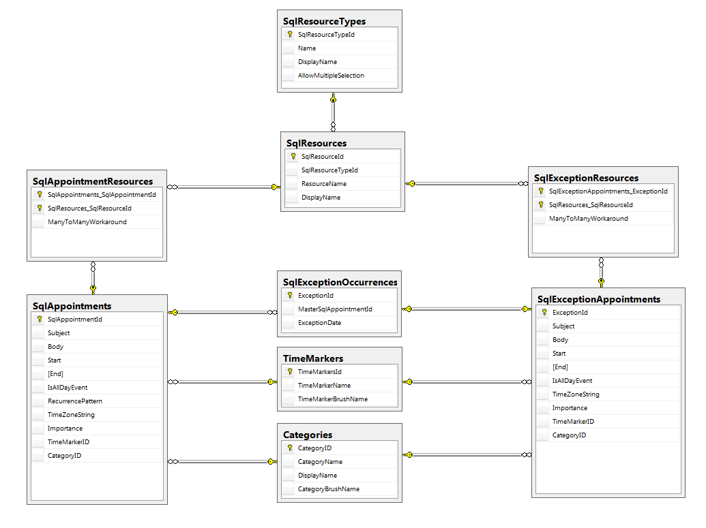

# Table Definitions

We have table definitions in the database according for the following types in the RadScheduleView:

IAppointment & IExtendedAppointment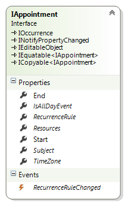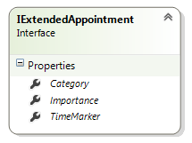SqlAppointments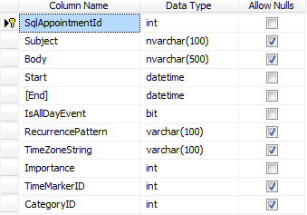IResource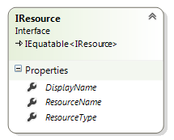SqlResources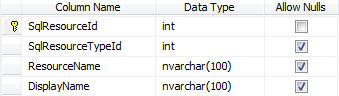IExceptionOccurrence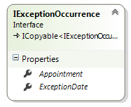SqlExceptionOccurrences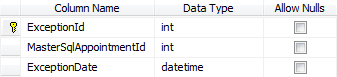IResourceType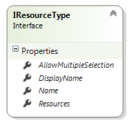SqlResourceTypes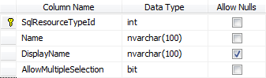ICategory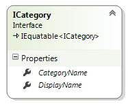Categories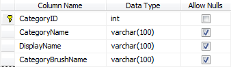ITimeMarker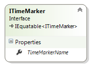TimeMarkers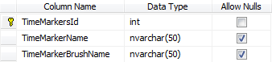

# Relationships

Here are some explanations about the keys and the relationships in the data tables:NameBetweenTypeUpdate/delete ruleFK_SqlResources_SqlResourceTypesSqlResourceTypes  - SqlResourcesOne-to-manyNo ActionFK_SqlAppointmentResources_SqlResourceSqlResources - SqlAppointmentResourcesOne-to-manyCascadeFK_SqlExceptionResources_SqlResourceSqlResources -  SqlExceptionResourcesOne-to-manyCascadeFK_SqlExceptionOccurrences_SqlAppointmentsSqlAppointments -  SqlExceptionOccurrencesOne-to-manyCascadeFK_SqlExceptionAppointments_SqlExceptionOccurrencesSqlExceptionOccurrences -  SqlExceptionAppointmentsOne-to-manyCascadeFK_SqlAppointments_TimeMarkersTimeMarkers -  SqlAppointmentsOne-to-manyNo ActionFK_SqlExceptionAppointments_TimeMarkersTimeMarkers -  SqlExceptionAppointmentsOne-to-manyNo ActionFK_SqlAppointments_CategoriesCategories -   SqlAppointmentsOne-to-manyNo ActionFK_SqlExceptionAppointments_CategoriesCategories -  SqlExceptionAppointmentsOne-to-manyNo ActionFK_SqlExceptionResources_SqlExceptionAppointmentCategories -  SqlExceptionAppointmentsOne-to-manyCascadeFK_SqlAppointmentResources_SqlAppointmentSqlAppointment -  SqlAppointmentResourcesOne-to-manyCascade

* 
							There is no table definition for the __IRecurrenceRule__ type because we don’t need it. Storing the __RecurrencePattern__ is enough to generate the recurrence rules at run-time.
						

* 
							We cannot save the Brush type into the database directly, that’s why we can save a string that represents the color and convert the string to __SolidColerBrush__ object when the TimeMarkers & Categories are loaded.
						

* 
							The __SqlAppointmentResource__ and __SqlExceptionResources__ are cross-tables between:
							

* SqlAppointments & SqlResources

* SqlExceptionAppointments & SqlResources

# See Also

# Other Resources

# See Also

# Other Resources
