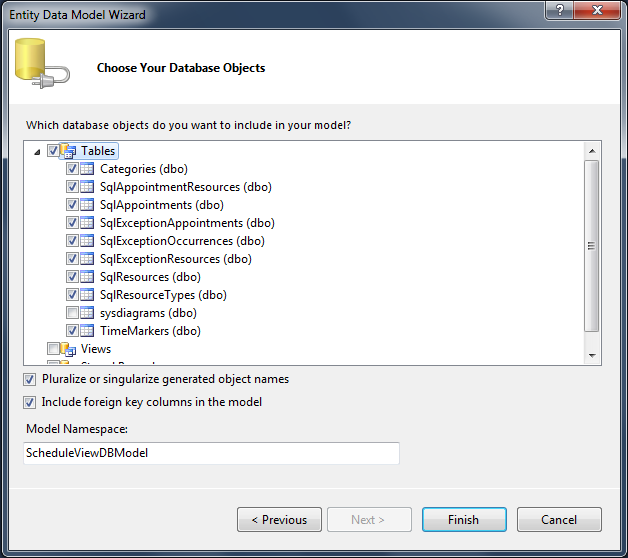

# 

Now, when we have the table definitions that match the types in the RadScheduleView control in a very common way, we can continue with generating the Entity Model:Select the project and select Add -> New item -> ADO.NET Entity Data ModelEnter a name and select AddFrom the __Entity Data Model Wizard__ select __Generate from database**__ model and click nextSet a connection string to the database and click nextSelect the tables from the database that will be used.
      		

Click Finish. The generated model looks like the following diagram:

[Models]({{slug:models}})
