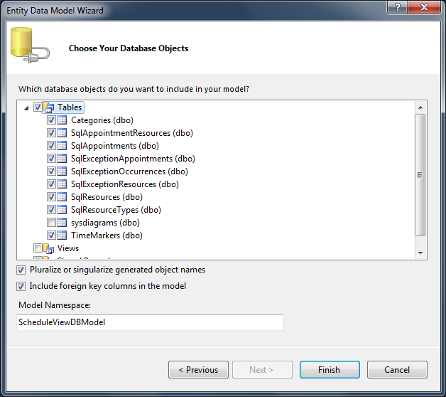
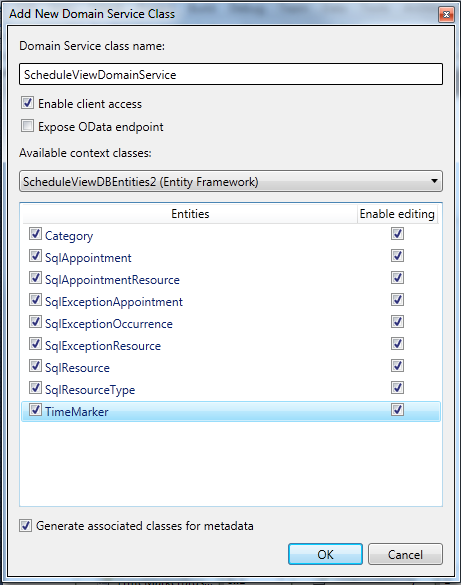

# 

Now, when we have the table definitions that match the types in the RadScheduleView control in a very common way, we can continue with generating the Entity Model:Select the web project and select Add -> New item -> ADO.NET Entity Data ModelEnter a name and select AddFrom the __Entity Data Model Wizard__ select __Generate from database**__ model and click nextSet a connection string to the database and click nextSelect the tables from the database that will be used.
      		

Click Finish. The generated model looks like the following diagram:

Once the entity model is ready, rebuild the project. We will use the WCF RIA Service to generate the types on the client side (Silverlight) and to synchronize the objects in the client side and server side. So, we can focus on the business logic and add a new domain service class:
        Select the web project and select Add -> New item -> Domain Service classEnter name and click AddThe “Add New Domain Service Class” dialog opens. Select the DataContext and check all the Entities for editing. Please, note that “Enable client access” and “Generate associated classes for metadata” must be checked.
        

Once the domain service class is added, rebuild the project as well. Let’s add the __GetSqlAppointmentsByRange(DateTime start, DateTime end)__ method to the DomainContext class because we want to load only the visible appointments:
        

private int[] GetSqlAppointmentsIdsByRange(DateTime start, DateTime end)
{
	var result = this.ObjectContext.SqlAppointments.Where(a => (a.Start >= start && a.End <= end)).ToList<SqlAppointment>();

	return result.OfType<SqlAppointment>().Select(e => e.SqlAppointmentId).ToArray();
}

public IQueryable<SqlAppointment> GetSqlAppointmentsByRange(DateTime start, DateTime end)
{
	var ids = GetSqlAppointmentsIdsByRange(start, end);

	var result = this.ObjectContext.SqlAppointments.Where(a => ids.Contains(a.SqlAppointmentId)).ToList<SqlAppointment>();

	// Load the recurrent appointments
	foreach (var item in this.ObjectContext.SqlAppointments.Where(a => !string.IsNullOrEmpty(a.RecurrencePattern)))
	{
		if (Helper.IsOccurrenceInRange(item.RecurrencePattern, start, end) && !result.Contains(item))
		{
			result.Add(item);
		}
	}

	// Load the exceptions
	foreach (var item in this.ObjectContext.SqlAppointments.Where(a => a.Start < end && a.SqlExceptionOccurrences.Count != 0))
	{
		if (item.SqlExceptionOccurrences.Any(e => e.SqlExceptionAppointment != null && 
													e.SqlExceptionAppointment.Start >= start && 
													e.SqlExceptionAppointment.End <= end))
		{
			result.Add(item);
		}
	}

	return result.AsQueryable<SqlAppointment>();
}[Silverlight Part](http://radscheduleview-populating-with-data-binding-to-db-silverlight.md)
