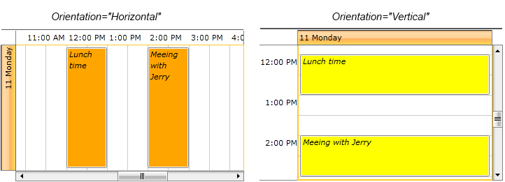
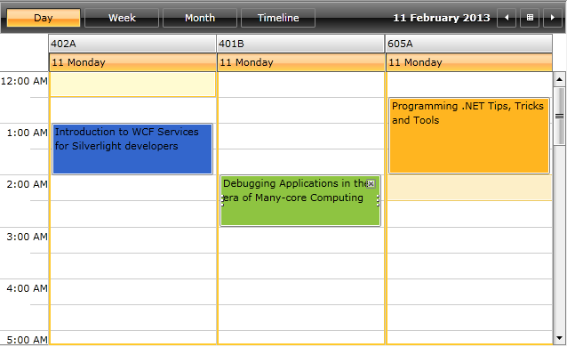

__RadScheduleView__ control makes it easy to customize the look & feel of an __Appointment__. Not only you can customize the way Appointments look (a simple and basic customization), but you can also create a custom AppointmentStyleSelector to conditionally apply different appointment styles depending on resource types, for example.

			

This article will cover the following topics:

[How to generate and use AppointmentStyleSelector](#Styling_Appointments)

[How to create a custom AppointmentStyleSelector.](#Using_the_AppointmentStyleSelector_to_style_Appointments)

# Styling_AppointmentsGenerate and use AppointmentStyleSelector


					Any change on the appearance of an Appointment depends on the AppointmentStyleSelector and the containing styles. The selector is oriented, meaning it contains orientation dependant styles – horizontal and vertical.
				


					First, you should obtain the source code of AppointmentStyleSelector:
				


					In the RadControls installation folder on your pc, go to Themes folder (Themes.Implicit in case you're using [Implicit Styles](f7b879d9-62ca-42c3-a919-983c7cbc79a2)) and select the theme that you use in your application. Drill down to find the __Telerik.Windows.Controls.ScheduleView.xaml__ file in that directory. From this resource dictionary you can extract the AppointmentStyleSelector and any needed resources that it uses.
				


					The end result should include the following:
				


    __XAML__
    

```XAML


<local:OrientedAppointmentItemStyleSelector x:Key="AppointmentItemStyleSelector">
    <local:OrientedAppointmentItemStyleSelector.MonthViewStyle>
        <Style TargetType="local:AppointmentItem" BasedOn="{StaticResource AppointmentItemBaseStyle}">
            <Setter Property="Margin" Value="2 1 2 0" />
		</Style>
	</local:OrientedAppointmentItemStyleSelector.MonthViewStyle>
	<local:OrientedAppointmentItemStyleSelector.HorizontalStyle>
		<Style TargetType="local:AppointmentItem" BasedOn="{StaticResource AppointmentItemBaseStyle}">
			<Setter Property="Margin" Value="0 1 0 0" />
		</Style>
	</local:OrientedAppointmentItemStyleSelector.HorizontalStyle>
	<local:OrientedAppointmentItemStyleSelector.VerticalStyle>
		<Style TargetType="local:AppointmentItem" BasedOn="{StaticResource AppointmentItemBaseStyle}">
			<Setter Property="Template" Value="{StaticResource AppointmentItemVerticalControlTemplate}" />
			<Setter Property="Margin" Value="1 0 0 0" />
		</Style>
	</local:OrientedAppointmentItemStyleSelector.VerticalStyle>
</local:OrientedAppointmentItemStyleSelector>

```


where "*local*" is:


    __XAML__
    

```XAML


xmlns:local="clr-namespace:Telerik.Windows.Controls;assembly=Telerik.Windows.Controls.ScheduleView"

```


						If you are using the default OfficeBlack theme or you've set a different theme with StyleManager, you should copy all the referenced resources from the RadScheduleView XAML file into your project.
					


						If you are using [Implicit Styles](f7b879d9-62ca-42c3-a919-983c7cbc79a2) and merge the ResourceDictionaries, you will be able to reference the needed resources directly.
					


					Note that you have both __HorizontalStyle__ and __VerticalStyle__. 
					RadScheduleView supports __Orientation__ for all its view definitions. Therefore a HorizontalStyle is applied when the appointment is horizontally oriented, while the VerticalStyle is applied when the appointment is vertically oriented.
				
    
    	


						When making changes to the generated AppointmentStyleSelector, you should apply those changes to both the HorizontalStyle and the VerticalStyle in order for your appointments to look consistent in all views.
					

So, let's for example modify the background color and style of the appointments:


    __XAML__
    

```XAML


<local:OrientedAppointmentItemStyleSelector x:Key="AppointmentItemStyleSelector">
	<local:OrientedAppointmentItemStyleSelector.MonthViewStyle>
		<Style TargetType="local:AppointmentItem" BasedOn="{StaticResource AppointmentItemBaseStyle}">
			<Setter Property="Margin" Value="2 1 2 0" />
		</Style>
	</local:OrientedAppointmentItemStyleSelector.MonthViewStyle>
	<local:OrientedAppointmentItemStyleSelector.HorizontalStyle>
		<Style TargetType="local:AppointmentItem" BasedOn="{StaticResource AppointmentItemBaseStyle}">
			<Setter Property="Margin" Value="0 1 0 0" />
			<Setter Property="Background" Value="Orange" />
			<Setter Property="FontStyle" Value="Italic" />
		</Style>
	</local:OrientedAppointmentItemStyleSelector.HorizontalStyle>
	<local:OrientedAppointmentItemStyleSelector.VerticalStyle>
		<Style TargetType="local:AppointmentItem" BasedOn="{StaticResource AppointmentItemBaseStyle}">
			<Setter Property="Template" Value="{StaticResource AppointmentItemVerticalControlTemplate}" />
			<Setter Property="Margin" Value="1 0 0 0" />
			<Setter Property="Background" Value="Yellow" />
			<Setter Property="FontStyle" Value="Italic" />
		</Style>
	</local:OrientedAppointmentItemStyleSelector.VerticalStyle>
</local:OrientedAppointmentItemStyleSelector>

```


And assign the AppointmentStyleSelector to the ScheduleView:


    __XAML__
    

```XAML


<telerik:RadScheduleView AppointmentsSource="{Binding Appointments}" 
						 AppointmentStyleSelector="{StaticResource AppointmentItemStyleSelector}">
	...
</telerik:RadScheduleView>

```


The end result in DayViewDefinition with both Horizontal and Vertical Orientation is displayed below:

# Using_the_AppointmentStyleSelector_to_style_AppointmentsCreate a custom AppointmentStyleSelector


					The __AppointmentStyleSelector__ is a regular Style Selector and allows you to apply different appointment styles based on some custom logic. In the following example, we will apply a different style to appointments belonging to different [Resource Types](D7C21926-1825-4792-9FC1-2ED2170D2AC2).
				


					We will use a scenario in which we have an application containing a RadScheduleView with three conference rooms set as three resources. We assume that we already have an Appointment collection which is set as an __AppointmentSource__ of RadScheduleView , and each Appointment has been set a ResourceName and ResourceType via its __Resource__ property.
				


					Next ,we are going to use these resources and create the selector. Create a new Class which inherits __OrientedAppointmentItemStyleSelector__. Override its __SelectStyle()__ method and use __activeViewDefinition.GetOrientation()__ to determine whether to apply a horizontal or a vertical Style in your selector.  Then, your AppointmentStyleSelector would look like this:
				


    __C#__
    

```C#


	public class AppointmentStyleSelector : OrientedAppointmentItemStyleSelector
	{
		public Style Room402AHorizontalStyle { get; set; }
		public Style Room401BHorizontalStyle { get; set; }
		public Style Room605AHorizontalStyle { get; set; }

		public Style Room402AVerticalStyle { get; set; }
		public Style Room401BVerticalStyle { get; set; }
		public Style Room605AVerticalStyle { get; set; }

		public override Style SelectStyle(object item, DependencyObject container, ViewDefinitionBase activeViewDefinition)
		{
			IAppointment appointment = item as IAppointment;
			if (appointment == null)
			{
				return base.SelectStyle(item, container, activeViewDefinition);
			}
			IResource resource = appointment.Resources.OfType<IResource>().FirstOrDefault((IResource r) => r.ResourceType == "Room");

			if (resource != null)
			{
				if (activeViewDefinition.GetOrientation() == Orientation.Horizontal)
				{
					switch (resource.ResourceName)
					{
						case "402A": return this.Room402AHorizontalStyle;
						case "401B": return this.Room401BHorizontalStyle;
						case "605A": return this.Room605AHorizontalStyle;
						default: break;
					}
				}
				else
				{
					switch (resource.ResourceName)
					{
						case "402A": return this.Room402AVerticalStyle;
						case "401B": return this.Room401BVerticalStyle;
						case "605A": return this.Room605AVerticalStyle;
						default: break;
					}
				}
			}
			return base.SelectStyle(item, container, activeViewDefinition);
		}
	}

```


    
    	


						Note that you need to ensure that both horizontal and vertical cases have their corresponding styles - __horizontal styles__ are applied when the appointments have horizontal orientation (either by default or when the view they are placed in has been explicitly set a horizontal orientation), __vertical styles__ are applied when the appointments have vertical orientation(either by default or when the view they are placed in has been explicitly set a vertical orientation).
					


					We add all needed Resources and group our ScheduleView  by the "Room" ResourceType:
				


    __XAML__
    

```XAML


<telerik:RadScheduleView AppointmentsSource="{Binding Appointments}">
   <telerik:RadScheduleView.ViewDefinitions>
    <telerik:DayViewDefinition />
    <telerik:WeekViewDefinition />
    <telerik:MonthViewDefinition />
    <telerik:TimelineViewDefinition />
   </telerik:RadScheduleView.ViewDefinitions>

   <telerik:RadScheduleView.GroupDescriptionsSource>
    <telerik:GroupDescriptionCollection>
     <telerik:ResourceGroupDescription ResourceType="Room" />
    </telerik:GroupDescriptionCollection>
   </telerik:RadScheduleView.GroupDescriptionsSource>

   <telerik:RadScheduleView.ResourceTypesSource>
    <telerik:ResourceTypeCollection>
     <telerik:ResourceType Name="Room">
      <telerik:Resource ResourceName="402A" />
      <telerik:Resource ResourceName="401B" />
      <telerik:Resource ResourceName="605A" />
     </telerik:ResourceType>
    </telerik:ResourceTypeCollection>
   </telerik:RadScheduleView.ResourceTypesSource>   

  </telerik:RadScheduleView>

```


					Add the custom AppointmentStyleSelector with all the defined Styles:
				


    __XAML__
    

```XAML


<SolidColorBrush x:Key="Room402ABackground_Normal" Color="#FF3366CC" />
<SolidColorBrush x:Key="Room401BBackground_Normal" Color="#FF8EC441" />
<SolidColorBrush x:Key="Room605ABackground_Normal" Color="#FFFFB520" />

<example:AppointmentStyleSelector x:Key="CustomAppointmentStyleSelector">
	<example:AppointmentStyleSelector.Room402AHorizontalStyle>
		<Style TargetType="local:AppointmentItem" >
			<Setter Property="Background" Value="{StaticResource Room402ABackground_Normal}" />
		</Style>
	</example:AppointmentStyleSelector.Room402AHorizontalStyle>
	<example:AppointmentStyleSelector.Room401BHorizontalStyle>
		<Style TargetType="local:AppointmentItem" >
			<Setter Property="Background" Value="{StaticResource Room401BBackground_Normal}" />
		</Style>
	</example:AppointmentStyleSelector.Room401BHorizontalStyle>
	<example:AppointmentStyleSelector.Room605AHorizontalStyle>
		<Style TargetType="local:AppointmentItem" >
			<Setter Property="Background" Value="{StaticResource Room605ABackground_Normal}" />
		</Style>
	</example:AppointmentStyleSelector.Room605AHorizontalStyle>
	<example:AppointmentStyleSelector.Room402AVerticalStyle>
		<Style TargetType="local:AppointmentItem">					
			<Setter Property="Background" Value="{StaticResource Room402ABackground_Normal}" />
		</Style>
	</example:AppointmentStyleSelector.Room402AVerticalStyle>
	<example:AppointmentStyleSelector.Room401BVerticalStyle>
		<Style TargetType="local:AppointmentItem">				
			<Setter Property="Background" Value="{StaticResource Room401BBackground_Normal}" />
		</Style>
	</example:AppointmentStyleSelector.Room401BVerticalStyle>
	<example:AppointmentStyleSelector.Room605AVerticalStyle>
		<Style TargetType="local:AppointmentItem">				
			<Setter Property="Background" Value="{StaticResource Room605ABackground_Normal}" />
		</Style>
	</example:AppointmentStyleSelector.Room605AVerticalStyle>
</example:AppointmentStyleSelector>

```


					And assign it to the ScheduleView:
				


    __XAML__
    

```XAML


<telerik:RadScheduleView AppointmentsSource="{Binding Appointments}" 
						 AppointmentStyleSelector="{StaticResource CustomAppointmentStyleSelector}">
...
 </telerik:RadScheduleView>						 

```


					Now that we have our Resources set and our __AppointmentStyleSelector__ ready, let's see the final result. The appointment styles are applied in accordance with each Resource:
				[Resources](http://radscheduleview-features-resources.md)[Understanding Appointments](http://radscheduleview-getting-started-add-edit-delete-appointment.md)[Custom Appointment](http://radscheduleview-features-appointments-custom-appointment.md)
