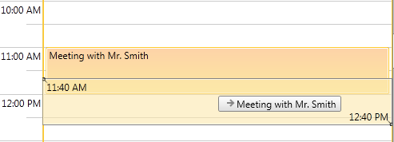
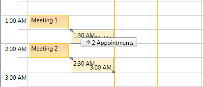
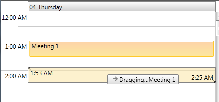
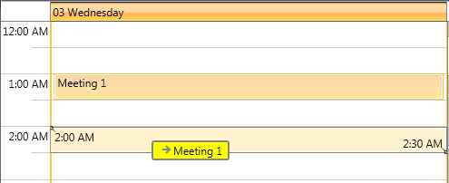

This help article explains how you could customize the visual element that is shown while the user is dragging an appointment in the __ScheduleView__ control.

You could change its look by setting DragVisualTemplate and DragVisualStyle properties.  We will go through each of them separately:

* DragVisualTemplate

* DragVisualStyle

# DragVisualTemplateDragVisualTemplate

__DragVisualTemplate__ property is of type DataTemplate and is used to define the content of the DragVisual.  It receives as DataContext a list of the dragged appointments (or occurrences in case of recurrent appointments). 

Here is the default DragVisualTemplate:

 __XAML__
    

	<DataTemplate x:Key="DragVisualContentTemplate">
		<TextBlock Text="{Binding Converter={StaticResource DraggedAppointmentsToLocalizedStringConverter}}" 
			TextWrapping="Wrap" 
			MaxWidth="200" 
			MaxHeight="66" 
			TextTrimming="WordEllipsis" />
	</DataTemplate>  

Note the use of DraggedAppointmentsToLocalizedStringConverter – it is needed to cover  the cases when multiple appointments are dragged:

Let’s for example, change the DataTemplate  as following:

 __XAML__
    

	<DataTemplate x:Key="DragVisualContentTemplate">
		<StackPanel Orientation="Horizontal">
			<TextBlock Text="Dragging..." />
			<TextBlock Text="{Binding Converter={StaticResource DraggedAppointmentsToLocalizedStringConverter}}" 
					TextWrapping="Wrap" 
					MaxWidth="200" 
					MaxHeight="66" 
					TextTrimming="WordEllipsis" />
		</StackPanel>
	</DataTemplate>

>

If you’re using [Implicit Styles](f7b879d9-62ca-42c3-a919-983c7cbc79a2), you will be able to reference DraggedAppointmentsToLocalizedStringConverter directly.  In other case you should manually add it as a resource before the DragVisualContentTemplate declaration:
					

 
							<telerik:DraggedAppointmentsToLocalizedStringConverter x:Key="DraggedAppointmentsToLocalizedStringConverter" />				
							

Then set the newly created template to the DragVisualTemplate property of the ScheduleView:

 __XAML__
    

	<telerik:RadScheduleView AppointmentsSource="{Binding Appointments}"
							DragVisualTemplate="{StaticResource DragVisualContentTemplate}">
		...
	</telerik:RadScheduleView>

Here is the result:

# DragVisualStyleDragVisualStyle

__DragVisualStyle__ property defines the look and behavior of the DragVisual element.

There are two approaches for customizing the DragVisualStyle according to the way you’re setting a theme to RadScheduleView:

* In case you’re using Implicit Styles and merge the needed XAML files as ResourceDictionaries:

* In case you’re using the default OfficeBlack theme or you've set a different theme with StyleManager:

Either approach you’ve selected, the final step is to set the custom DragVisual style to DragVisualStyle property of the ScheduleView:

 __XAML__
    

	<telerik:RadScheduleView AppointmentsSource="{Binding Appointments}"
							 DragVisualStyle="{StaticResource CustomDragVisualStyle}">
		...
	</telerik:RadScheduleView>

The result is:
