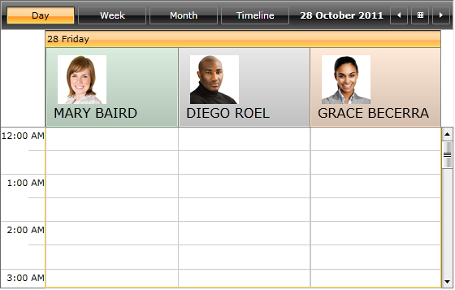

This help article explains in details how to use GroupHeaderContentTemplateSelector in order to set different DataTemplates to the GroupHeaders of __RadScheduleView__.

The article covers the following topics:

* How to generate and use GroupHeaderContentTemplateSelector

* How to create a custom GroupHeaderContentTemplateSelector

# How_to_Generate_GroupHeaderContentTemplateSelectorHow to generate and use GroupHeaderContentTemplateSelector	>

Since Q2 2011 release the GroupHeaderContentTemplateSelector contains only two templates – HorizontalTemplate and VerticalTemplate. 
      		

Choose one of the following approaches to obtain the source code of GroupHeaderContentTemplateSelector:

* Generate GroupHeaderContentTemplateSelector from installation folder

* Generate GroupHeaderContentTemplateSelector from RadScheduleView template

The end result should include the following XAML code:

 __XAML__
    	

<local:GroupHeaderTemplateSelector x:Key="GroupHeaderContentTemplateSelector">
	<local:GroupHeaderTemplateSelector.HorizontalTemplate>
		<DataTemplate>
			<ContentPresenter Content="{Binding FormattedName}" Height="16" Margin="4" />
		</DataTemplate>
	</local:GroupHeaderTemplateSelector.HorizontalTemplate>

	<local:GroupHeaderTemplateSelector.VerticalTemplate>
		<DataTemplate>
			<telerikPrimitives:LayoutTransformControl VerticalAlignment="Top">
				<telerikPrimitives:LayoutTransformControl.LayoutTransform>
					<RotateTransform Angle="-90" />
				</telerikPrimitives:LayoutTransformControl.LayoutTransform>
				<ContentPresenter Content="{Binding FormattedName}" Margin="4" Height="16"  />
			</telerikPrimitives:LayoutTransformControl>

		</DataTemplate>
	</local:GroupHeaderTemplateSelector.VerticalTemplate>
</local:GroupHeaderTemplateSelector>

Note the use of the local  and telerikPrimitives namespaces from the raw source:

 __XAML__
    	

xmlns:local="clr-namespace:Telerik.Windows.Controls;assembly=Telerik.Windows.Controls.ScheduleView"
xmlns:telerikPrimitives="clr-namespace:Telerik.Windows.Controls.Primitives;assembly=Telerik.Windows.Controls"

The selector is applied to our instance of RadScheduleView:

 __XAML__
    	

<telerik:RadScheduleView x:Name="scheduleView" 
        AppointmentsSource="{Binding Appointments}" 
        GroupHeaderContentTemplateSelector="{StaticResource GroupHeaderContentTemplateSelector }">

# How_to_Create_GroupHeaderContentTemplateSelectorHow to create a custom GroupHeaderContentTemplateSelector

Let’s, for example, create a custom Resource like this:

 __C#__
    	

public class EmployeeResource : Resource
{
	public string Photo { get; set; }
	public Brush Brush { get; set; }
}

And add the EmployeeResource to “Employee” ResourceType. Note that the RadScheduleView is grouped by this resource type.
       

 __XAML__
    	

<telerik:RadScheduleView AppointmentsSource="{Binding Appointments}" >
	<telerik:RadScheduleView.ViewDefinitions>
		<telerik:DayViewDefinition />		
	</telerik:RadScheduleView.ViewDefinitions>
	<telerik:RadScheduleView.GroupDescriptionsSource>
		<telerik:GroupDescriptionCollection>
			<telerik:DateGroupDescription />
			<telerik:ResourceGroupDescription ResourceType="Employee" />
		</telerik:GroupDescriptionCollection>
	</telerik:RadScheduleView.GroupDescriptionsSource>
	<telerik:RadScheduleView.ResourceTypesSource>
		<telerik:ResourceTypeCollection>
			<telerik:ResourceType Name="Employee">
				<local:EmployeeResource ResourceName="Mary Baird" DisplayName="MARY BAIRD"  Photo="Images/image1.png" Brush="#2D309B46" />
				<local:EmployeeResource ResourceName="Diego Roel" DisplayName="DIEGO ROEL"  Photo="Images/image2.png" Brush="#2D808080" />
				<local:EmployeeResource ResourceName="Grace Becerra" DisplayName="GRACE BECERRA" Photo="Images/image3.png" Brush="#26FF6900 " />
			</telerik:ResourceType>
		</telerik:ResourceTypeCollection>
	</telerik:RadScheduleView.ResourceTypesSource>
</telerik:RadScheduleView>   

In order to set different templates  to the GroupHeaders , we should create a custom class which inherits ScheduleViewDataTemplateSelector  and overrides its SelectTemplate method. Also we need to add the DataTemplates  for resource  and date GroupHeaders and return the corresponding template:
       

 __C#__
    	

public class CustomGroupHeaderContentTemplateSelector : ScheduleViewDataTemplateSelector
{
	public DataTemplate HorizontalTemplate { set; get; }
	public DataTemplate VerticalTemplate { set; get; }
	public DataTemplate HorizontalResourceTemplate { set; get; }
	public DataTemplate VerticalResourceTemplate { set; get; }

	public override DataTemplate SelectTemplate(object item, DependencyObject container, ViewDefinitionBase activeViewDeifinition)
	{
		CollectionViewGroup cvg = item as CollectionViewGroup;
		if (cvg != null && cvg.Name is IResource)
		{
			if (activeViewDeifinition.GetOrientation() == Orientation.Vertical)
			{
				if (this.HorizontalResourceTemplate != null)
				{
					return this.HorizontalResourceTemplate;
				}
			}
			else
			{
				if (this.VerticalResourceTemplate != null)
				{
					return this.VerticalResourceTemplate;
				}
			}
		}

		if (cvg != null && cvg.Name is DateTime)
		{
			if (activeViewDeifinition.GetOrientation() == Orientation.Vertical)
			{
				return this.HorizontalTemplate;
			}
			else
			{
				return this.VerticalTemplate;
			}
		}
		return base.SelectTemplate(item, container, activeViewDeifinition);
	}
}

Add the DataTemplates to the XAML:

 __XAML__
    	

<local:CustomGroupHeaderContentTemplateSelector x:Key="CustomGroupHeaderContentTemplateSelector">
	<local:CustomGroupHeaderContentTemplateSelector.HorizontalTemplate>
		<DataTemplate>
			<TextBlock Margin="4" Text="{Binding Name, StringFormat=dd dddd}"/>
		</DataTemplate>
	</local:CustomGroupHeaderContentTemplateSelector.HorizontalTemplate>
	<local:CustomGroupHeaderContentTemplateSelector.VerticalTemplate>
		<DataTemplate>
			<telerik:LayoutTransformControl>
				<telerik:LayoutTransformControl.LayoutTransform>
					<RotateTransform Angle="-90" />
				</telerik:LayoutTransformControl.LayoutTransform>
				<TextBlock Margin="4" Text="{Binding Name, StringFormat=dd dddd}" VerticalAlignment="Top" />
			</telerik:LayoutTransformControl>
		</DataTemplate>
	</local:CustomGroupHeaderContentTemplateSelector.VerticalTemplate>
	<local:CustomGroupHeaderContentTemplateSelector.HorizontalResourceTemplate>
		<DataTemplate>
			<Border Background="{Binding Name.Brush}" Height="100" Margin="1 1 1 0">
				<StackPanel Margin="10 10 10 10">
					<Image Width="60" Height="60" Margin="5 0 10 0" HorizontalAlignment="Left" Stretch="UniformToFill" Source="{Binding Name.Photo}" />
					<TextBlock  FontSize="16" Margin="0" Text="{Binding Name.DisplayName}" />
				</StackPanel>
			</Border>
		</DataTemplate>
	</local:CustomGroupHeaderContentTemplateSelector.HorizontalResourceTemplate>
	<local:CustomGroupHeaderContentTemplateSelector.VerticalResourceTemplate>
		<DataTemplate>
			<Border Background="{Binding Name.Brush}"  Width="140" Margin="0 2 2 2">
				<StackPanel Margin="15 13 0 10">
					<Image Width="60" Height="60" Margin="0" HorizontalAlignment="Left" VerticalAlignment="Top" Stretch="UniformToFill" Source="{Binding Name.Photo}" />
					<TextBlock Margin="-2 3 0 5" FontSize="16" Text="{Binding Name.DisplayName}" />
				</StackPanel>
			</Border>
		</DataTemplate>
	</local:CustomGroupHeaderContentTemplateSelector.VerticalResourceTemplate>
</local:CustomGroupHeaderContentTemplateSelector>

	>

Note how the properties of the custom resource are binded using Name property:

 __XAML__
    	

Source="{Binding Name.Photo}"

Finally, set the GroupHeaderContentTemplateSelector property of the ScheduleView:

 __XAML__
    	

<telerik:RadScheduleView AppointmentsSource="{Binding Appointments}" 
		GroupHeaderContentTemplateSelector="{StaticResource CustomGroupHeaderContentTemplateSelector}">
	...	
</telerik:RadScheduleView>

Here is the result:

Check out the 
      	[online demo](http://demos.telerik.com/silverlight/#ScheduleView/CustomStyles/GroupHeaderTemplate)GroupHeaderTemplate Example at 
      	[WPF demos](http://demos.telerik.com/wpf/)
      	to see the GroupHeaderContentTemplateSelector in action.
