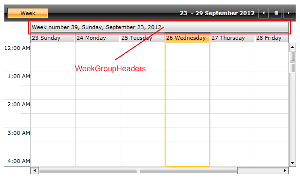

	>

You can check [Configuration]({{slug:configuration}}) article for more information about the common for all views properties.

# DayView and WeekView specific properties

Except all the common properties some of the ViewDefinitions have specific properties. 
        Here is a list of such kind of properties for DayView and WeekView:

__ShowWeekGroupHeaders__ – get or sets whether the WeekHeaders should be visible.
        

__WeekGroupHeaderStringFormat__ – gets or sets the format that will be applied to the WeekHeaders. After setting the __ShowWeekGroupHeaders__ to 
        __True__ you can customize the string format of the week numbers displayed in the Header.
        

The following code snippet shows how to set the __ShowWeekGroupHeaders__ and __WeekGroupHeaderStringFormat__ property in WeekView:
        


 __XAML__
    

```XAML


        <telerik:RadScheduleView x:Name="scheduleView" AppointmentsSource="{Binding Appointments}">
            <telerik:RadScheduleView.ViewDefinitions>
                <telerik:WeekViewDefinition ShowWeekGroupHeaders="True" WeekGroupHeaderStringFormat="Week number {0}, {1:D}" />
            </telerik:RadScheduleView.ViewDefinitions>
        </telerik:RadScheduleView>

```


 __C#__
    

```C#


     weekDefinition.ShowWeekGroupHeaders = true;
	 weekDefinition.WeekGroupHeaderStringFormat = "Week number {0}, {1:D}";

```


Here is the end result:



# Timeline specific properties

There are certain properties which are specific for TimelineView. Here is the list of those properties:

__StretchAppointments__ – sets whether the appointments will be stretched to fill all available space in the TimeSlot.
        

__TimeRulerGroupStringFormat__ – sets the format applied on TimeRulerGroupItem.
        
